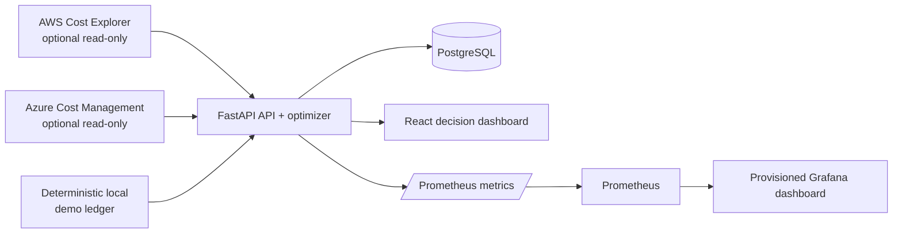

# Architecture

CloudCost IQ is a **local-first FinOps demonstrator**. Its normal development path runs entirely on a local workstation through Docker Compose and does not need AWS or Azure credentials. The FastAPI service seeds a deterministic demonstration ledger so the product can show the full intake, analysis, recommendation, metrics, and dashboard journey without claiming that the values are a real organization’s spend.

> **Safety boundary:** The bundled ledger is a UI-and-test fixture, not billing evidence. Do not use it to approve cloud-spend decisions. Real provider synchronization is off by default and requires explicit read-only configuration.

## Data model

| Entity | Purpose | Key controls |
|---|---|---|
| `spend_records` | A normalized daily cost ledger across provider, scope, service, resource, tags, and currency. | Stores the source (`demo` or `live`) to preserve provenance. |
| `recommendations` | Prioritized, reviewable savings opportunities. | Records evidence, confidence, category, monthly savings estimate, and workflow status. |
| `sync_runs` | Provider-ingestion audit trail. | Captures provider, status, record count, source, error, and completion time. |

The current rules intentionally generate **review prompts**, not automatic changes. Unattached storage maps to high-confidence removal review, sustained low utilization maps to rightsizing review, and cross-zone/inter-region traffic maps to network-path review. A human must validate workload peaks, memory, commitments, availability requirements, and data-retention policy before action.

## Provider integration contracts

| Provider | Integration path | Local default | Production safety rule |
|---|---|---|---|
| AWS | Cost Explorer SDK, grouped by service and daily amortized cost. | Disabled. | Use a narrowly scoped billing role and set `CLOUDCOST_ALLOW_LIVE_SYNC=true` only after review. AWS documents that Cost Explorer must be explicitly permitted and recommends SDKs for signed requests. [1] |
| Azure | Cost Management Query API using a server-side OAuth client-credentials token. | Disabled. | Use a read-only service principal at the intended billing scope; do not place secrets in the browser or repository. Microsoft describes the Query API as a way to query usage data for a defined scope. [2] |
| Azure alternative | Scheduled Cost Management exports to a protected Storage account. | Not enabled by the app. | Prefer exports for larger datasets and scheduled ingestion; Microsoft documents daily/monthly exports and multiple export datasets. [3] |

## Metrics and observability

The API exposes Prometheus-compatible metrics at `/metrics`. Prometheus scrapes this endpoint every 15 seconds in the local stack; Grafana provisions the **CloudCost Operations Overview** dashboard automatically. The dashboard includes API request rate, open recommendations, and potential monthly savings.

| Metric | Meaning |
|---|---|
| `cloudcost_api_requests_total` | API request counter, grouped by route and method. |
| `cloudcost_open_recommendations` | Current number of recommendations awaiting review. |
| `cloudcost_potential_monthly_savings_usd` | Sum of the currently open recommendation estimates. |

## References

[1] [AWS, *Using the Cost Explorer API*](https://docs.aws.amazon.com/cost-management/latest/userguide/ce-api.html)

[2] [Microsoft, *Cost Management Query REST API*](https://learn.microsoft.com/en-us/rest/api/cost-management/query)

[3] [Microsoft, *Create and manage Cost Management exports*](https://learn.microsoft.com/en-us/azure/cost-management-billing/costs/tutorial-improved-exports)
